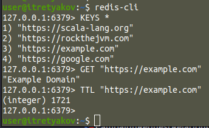
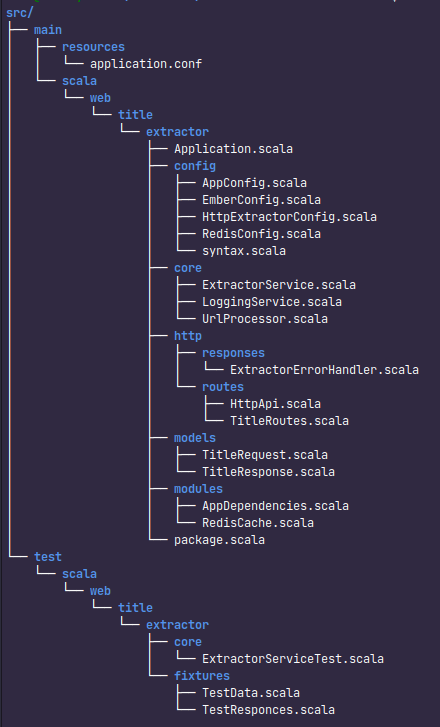

# Web Title Extractor Service

## Описание проекта

Сервис для извлечения заголовков (title) веб-страниц по списку URL. Принимает HTTP запрос со списком URL и возвращает для каждого URL найденный заголовок страницы.

## Технические требования

- Язык реализации: Scala 3
- HTTP сервер: http4s
- ФП стек: Cats Effect
- Конфигурация: PureConfig
- Кэширование: Redis
- Тестирование: ScalaTest

## Функциональность

### Основные возможности:
- Принимает POST запрос с JSON списком URL
- Извлекает заголовки страниц (содержимое тега `<title>`)
- Возвращает JSON с результатами для каждого URL
- Поддерживает кэширование результатов
- Ограничивает максимальное количество URL в одном запросе
- Фильтрует разрешенные домены

### Ограничения:
- Настраивается максимальное количество URL в одном запросе
- Настраивается таймаут запроса
- Поддерживаются только HTTP/HTTPS URL

## API Endpoints

### POST /api/extractor/titles

**Запрос:**
```json
{
  "urls": [
    "https://example.com",
    "https://scala-lang.org"
  ]
}
```

**Успешный ответ (200 OK):**
```json
[
  {
    "url": "https://example.com",
    "title": "Example Domain"
  },
  {
    "url": "https://scala-lang.org",
    "title": "The Scala Programming Language"
  }
]
```


## Запуск проекта

### Требования:
- Java 11+
- Docker (опционально)
- sbt

### Запуск бэкенда:

Собрать и запустить приложение:
```bash
sbt run
```

### Тестирование:
```bash
sbt test
```

## Архитектура

### Основные компоненты:
1. **HTTP API** (http4s) - обработка запросов
2. **ExtractorService** - основная бизнес-логика
3. **UrlProcessor** - извлечение заголовков страниц
4. **RedisCache** - кэширование результатов
5. **Config** - конфигурация приложения

### Поток данных:
1. HTTP запрос → JSON парсинг → валидация URL
2. Проверка кэша Redis → запрос страницы (если нет в кэше)
3. Парсинг HTML → извлечение title
4. Сохранение в кэш → формирование ответа

## Принятые решения

1. **Кэширование**:
   - Используется Redis для хранения результатов
   - TTL кэша: 1 час (настраивается)

2. **Обработка ошибок**:
   - Невалидные URL пропускаются с сообщением об ошибке
   - Ошибки загрузки страниц не прерывают обработку других URL

3. **Безопасность**:
   - Ограничение на количество URL в запросе
   - Настраивается "белый" список разрешенных доменов
   - Таймауты и редиректы на HTTP запросы

4. **Производительность**:
   - Параллельная обработка URL
   - Кэширование для повторяющихся запросов

## Пример использования получения данных с URL-ов
запрос
```bash
curl -X POST \
  http://localhost:8080/api/extractor/titles \
  -H 'Content-Type: application/json' \
  -d '{
       "urls": [
          "https://example.com",
          "https://google.com",
          "https://scala-lang.org",
          "https://rockthejvm.com"
          ]
       }'
```

Ответ:
```json
[
    {
        "url": "https://example.com",
        "title": "Example Domain"
    },
    {
        "url": "https://google.com",
        "title": "Google"
    },
    {
        "url": "https://scala-lang.org",
        "title": "The Scala Programming Language"
    },
    {
        "url": "https://rockthejvm.com",
        "title": "No title"
    }
]
```
## Использование Redis
Подключение к Redis через командную строку:
```bash
user@itretyakov:~$ redis-cli
```

Проверить все ключи:
```bash
127.0.0.1:6379> KEYS *
```

Получить значение по конкретному ключу:
```bash
127.0.0.1:6379> GET "https://example.com"
```

Проверить TTL ключа:
```bash
127.0.0.1:6379> TTL "https://example.com"

```


## Дерево



